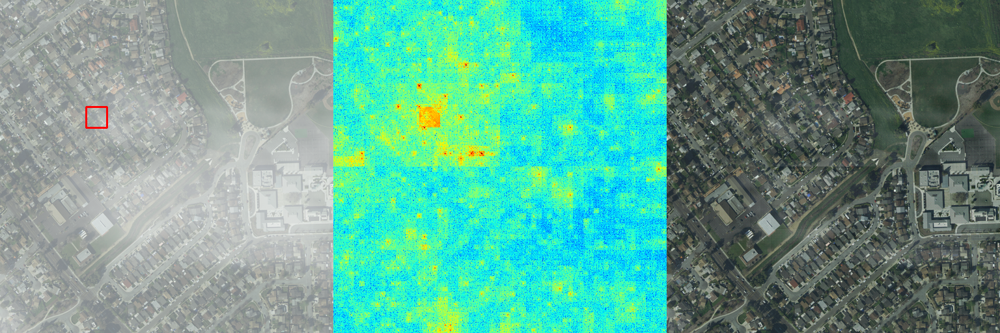

# Dehazing Attribution Map (去雾归因图)

This repository provides the official implementation of the **Dehazing Attribution Map** section from the **CVPR2025** paper: [Tokenize Image Patches: Global Context Fusion for Effective Haze Removal in Large Images](https://arxiv.org/abs/2504.09621).

- 🔍 Visualizing image regions critical for dehazing model decisions.
- 📊 Quantifying contributions of global context information to dehazing effectiveness.
- ⚙️ Enhancing interpretability of deep learning-based dehazing models.

---

*The source code for the proposed **DehazeXL** model is available at [GitHub](https://github.com/CastleChen339/DehazeXL). The mini version of the proposed dataset **8Kdehaze** can be accessed here: [Modelscope](https://www.modelscope.cn/datasets/fengyanzi/8kdehaze_mini/) | [Hugging Face](https://huggingface.co/datasets/fengyanzi/8KDehaze_mini) | [BaiduCloud](https://pan.baidu.com/s/1ZVipOYnTR-M_xG5FZNtZPQ?pwd=4321) | [AliCloud](https://www.alipan.com/s/7AVat72s4Sk).

For the full version of **8Kdehaze**, visit: [BaiduCloud](https://pan.baidu.com/s/1-z7h-BLV7BxNg4Qp6Hi5uQ?pwd=4321).

---



### Quick Start 🚀

Before using this project, make sure all necessary dependencies are installed. You can install them via:

```bash
pip install -r requirements.txt
```

Commonly used Python libraries for deep learning included:
```plaintext
numpy
torch
opencv-python
torchvision
Pillow
matplotlib
scipy
tqdm
```

To run the project (which includes DehazeXL):

1. Download test weights from: [GitHub](https://github.com/fengyanzi/DehazingAttributionMap/releases/tag/weight)
2. Place the weights in `./model/weights/weightforDAMtest.pth`
3. Execute:

```bash
python Dehaze_Demo.py
```

### Testing Your Own Model 🧪

1. Place the hazy and clear images you wish to test in the `./clear/dehaze` folder.
2. Put your dehazing model and its weights in the `model` folder.
3. Modify the following snippet in the `Dehaze_Demo.py` file to load your model and set parameters accordingly.

```python
from model.dehaze_backbones.xt.decoders.decoder_pre import xT as DehazeXL
    # Load your own model
    model = DehazeXL().to("cuda").eval()

    modelpath = r'model/weights/weightforDAMtest.pth'
    cloudimgpath = r'data/dehaze/test1.png'
    clearingpath = r'data/dehaze/clear1.png'
    save_path = './results/test.png'
```

### Parameter Description ⚙️

- `--modelpath`: Path to the model weights.
- `--imgpath`: Path to the test image.
- `--w`: X-coordinate of the selected area.
- `--h`: Y-coordinate of the selected area.
- `--window_size`: Size of the selected area.
- `--fold`: Number of path integral steps. Higher values yield results closer to the true value. Default is 50, not recommended to modify.
- `--sigma`: Path integral parameter, not recommended to modify.
- `--l`: Path integral parameter, not recommended to modify.
- `--alpha`: Alpha value for blending.
- `--zoomfactor`: Image zoom factor, default is 1. If your GPU configuration is low, consider setting it to 4.
- `--kde`: Whether to use KDE for visualization (requires high computational power).
- `--output_dir`: Output directory for images.
- `--betterview`: Improves the visibility of attribution maps.

## Code References 📚

This project was inspired by and references the following open-source projects. We appreciate their contribution to the community:
- [LAM](https://github.com/fengyanzi/Local-Attribution-Map-for-Super-Resolution)

## Citation 📝

If you use DAM, please cite:
```bibtex
@article{chen2025tokenize,
  title={Tokenize Image Patches: Global Context Fusion for Effective Haze Removal in Large Images},
  author={Chen, Jiuchen and Yan, Xinyu and Xu, Qizhi and Li, Kaiqi},
  journal={arXiv preprint arXiv:2504.09621},
  year={2025}
}
```


<!-- # Dehazing Attribution Map (去雾归因图)
This repository is an official implementation of the去雾归因图部分 of the paper  [Tokenize Image Patches: Global Context Fusion for Effective Haze Removal in Large Images](https://arxiv.org/abs/2504.09621)

- 🔍 可视化去雾模型决策依赖的图像区域
- 📊 量化全局上下文信息对去雾效果的贡献
- ⚙️ 改善基于深度学习的去雾模型可解释性

---
*The source code of论文所提出 DehazeXL are available at [https://github.com/CastleChen339/DehazeXL](https://github.com/CastleChen339/DehazeXL).
论文所提出数据集8Kdehaze可以在以下获得The mini version of 8Kdehaze was released: [Modelscope](https://www.modelscope.cn/datasets/fengyanzi/8kdehaze_mini/) [Hugging Face](https://huggingface.co/datasets/fengyanzi/8KDehaze_mini)  [BaiduCloud](https://pan.baidu.com/s/1ZVipOYnTR-M_xG5FZNtZPQ?pwd=4321)   [AliCloud](https://www.alipan.com/s/7AVat72s4Sk)

The Full version of 8Kdehaze:  [BaiduCloud](https://pan.baidu.com/s/1-z7h-BLV7BxNg4Qp6Hi5uQ?pwd=4321)

---

 

### Quick Start 


在使用该项目之前，请确保已安装所有必要的依赖库。你可以通过以下命令安装依赖：
```bash
pip install -r requirements.txt

```

其中只包含一些常见的深度学习python库：
```plaintext
numpy
torch
opencv-python
torchvision
Pillow
matplotlib
scipy
tqdm
```


要运行本项目
本项目内置DehazeXL
测试权重可以从以下位置获得：https://github.com/fengyanzi/DehazingAttributionMap/releases/tag/weight
首先请下载权重并放置在./model/weights/weightforDAMtest.pth

To run the project, execute:

执行以下命令：

```bash
python Dehaze_Demo.py
```


### 测试自己的模型

1. Place the 有雾和无雾的images to be tested in the `。/clear/dehaze` folder. 
2. Place the dehaze model and its weights in the `model` folder. 
3. Modify the following code in the `Dehaze_Demo.py` file to load your model and configure parameters.

```python
from model.dehaze_backbones.xt.decoders.decoder_pre import xT as DehazeXL
    # Load your own model
    model = DehazeXL().to("cuda").eval()

    modelpath = r'model/weights/weightforDAMtest.pth'
    cloudimgpath = r'data/dehaze/test1.png'
    clearingpath = r'data/dehaze/clear1.png'
    save_path = './results/test.png'
```

### Parameter Description 参数说明

- `--modelpath`: Path to the model weights. 模型权重路径。
- `--imgpath`: Path to the test image. 测试图像路径。
- `--w`: The x-coordinate of the selected area. 选择区域的 x 坐标。
- `--h`: The y-coordinate of the selected area. 选择区域的 y 坐标。
- `--window_size`: The size of the selected area. 区域大小。
- `--fold`: The number of path integral steps. Higher values are closer to the true value. Default is 50, not recommended to modify. 路径积分步数，越高越接近真实值，默认 50，不建议修改。
- `--sigma`: Path integral parameter, not recommended to modify. 路径积分参数，不建议修改。
- `--l`: Path integral parameter, not recommended to modify. 路径积分参数，不建议修改。
- `--alpha`: Alpha value for blending. 混合时的 alpha 值。
- `--zoomfactor`: 图像放大因子，默认1，如果你的电脑GPU配置较低，可酌情设置为4
- `--kde`: Whether to use KDE for visualization (requires high computational power). 是否使用 KDE 进行可视化（对电脑性能要求较高，时间较长）。
- `--output_dir`: Output image directory. 输出图片目录。
- `--betterview`: 改善归因图可视性


## Code References 代码编写参考

本项目在开发过程中参考了以下开源项目并受启发，感谢他们对开源社区的贡献：
- [LAM](https://github.com/fengyanzi/Local-Attribution-Map-for-Super-Resolution)

## Citation 引用

If you use DAM, please cite:
在使用 DAM 时，请引用以下文章,诚挚感谢：

```bibtex
@article{chen2025tokenize,
  title={Tokenize Image Patches: Global Context Fusion for Effective Haze Removal in Large Images},
  author={Chen, Jiuchen and Yan, Xinyu and Xu, Qizhi and Li, Kaiqi},
  journal={arXiv preprint arXiv:2504.09621},
  year={2025}
}
```
 -->
